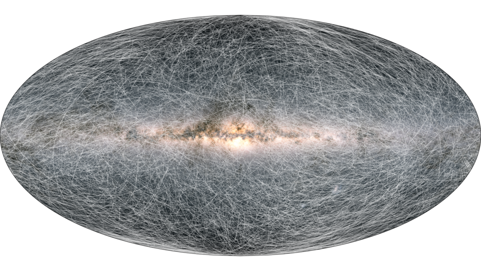

# gaiaedr3-proper-motion-visualizations

This repository contains Python code and Jupyter notebooks for the visualization of proper motions in Gaia EDR3 that
 were produced as part of the release day outreach efforts. The visualizations are featured in this [Gaia EDR3 Story
 ](https://www.cosmos.esa.int/web/gaia/edr3-startrails).

Copyright: Anthony G.A. Brown, Leiden University
